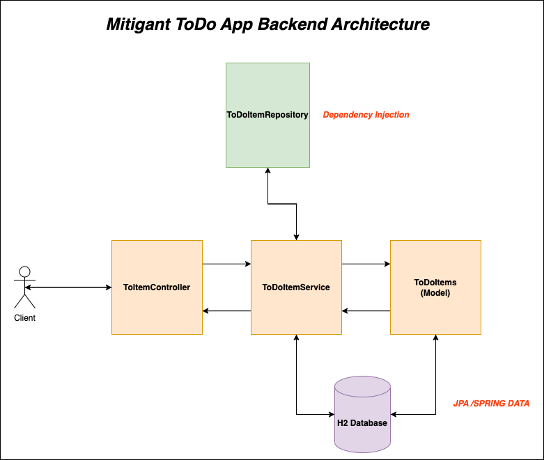

# Mitigant Spring Boot ToDo App Backend Service

[](https://github.com/shivudu1994/simple-todo-app/actions/workflows/maven.yml)


This is a RESTful web service that provides functionalities to manage to-do items.

Overall backend workflow as described below.
Reference : https://techwithmaddy.com/spring-boot-architecture



## **Assumptions**

The service assumes that:

1.  The due date-time is in the future when adding them into database.
2.  The due date-time and description of the task is mandatory when adding them into database.
3.  The description should not be empty while updating the database.
4.  You can't update the Status to done  when the todo item status is already a past due or done status.
5.  You can't update the Status to not done  when the todo item status is already a past due or done status. (Because , Here i have assumed that user may mistakenly update the status not done  to done. Here user have a possibility to revert the changes)


## **Tech Stack**

- Java 17
- Spring Boot 3.0.3
- H2 in-memory database
- JPA
- Maven
- Other Libraries includes following
    - Lombok to avoid boilerplate code
    - slf4j for logging
    - RestTemplate for testing

## **How to Build the Service**

- Clone the repository

- Open a terminal in the root directory of the project

- Run the following command:
  ```
  mvn clean package
  ```


## **How to Run the Service Locally**

### **With Docker**
1. Build the Docker image:
   ``` 
   docker build -t simple-todo-backend .
   ```
3. Run the Docker container:
   ```
   docker run -p 8080:8080 simple-todo-backend
   ```
   

### **Without Docker**

1. Open a terminal in the root directory of the project
2. Run the following command:
   ```
   mvn spring-boot:run
   ```
## **How to Run Automatic Tests**

1. Open a terminal in the root directory of the project
2. Run the following command:
   ```
   mvn test
   ```

## **RESTful API Endpoints**

| HTTP Method |                      URI                       |            Action            |
|:------------|:----------------------------------------------:|:----------------------------:|
| POST        |      /v1/api/todo-items/create-todo-item       |      Create ToDo Items       |
| PUT         |      /v1/api/todo-items/{id}/description       |      Update Description      |
| PUT         |   /v1/api/todo-items/update-done-status/{id}   |      Update done status      |
| PUT         | /v1/api/todo-items/update-not-done-status/{id} |    Update not done status    |
| GET         |      /v1/api/todo-items/get-all-not-done       | get all with not done status |
| GET         |       /v1/api/todo-items/get-by-id/{id}        |     get task item by  ID     |


